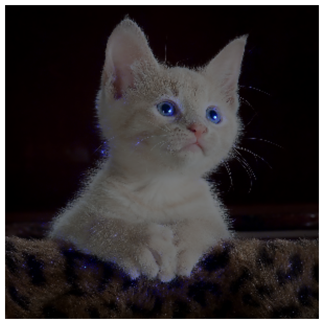

# Saliency Maps for Cats vs Dogs Classifier

This project generates saliency maps to visualize which parts of an image contribute the most to the model's classification decision. It is based on the Cats vs Dogs dataset and uses a CNN model for classification.

## Requirements
- TensorFlow
- OpenCV
- Matplotlib
- NumPy

## Instructions
- Clone this repository.
- Install the required dependencies.
- Run the script to generate saliency maps for images.

## Saliency Map Example

## Contributing

Feel free to fork this project, submit issues, and open pull requests. Contributions are welcome!
If you have any questions or suggestions, please open an issue or contact me.